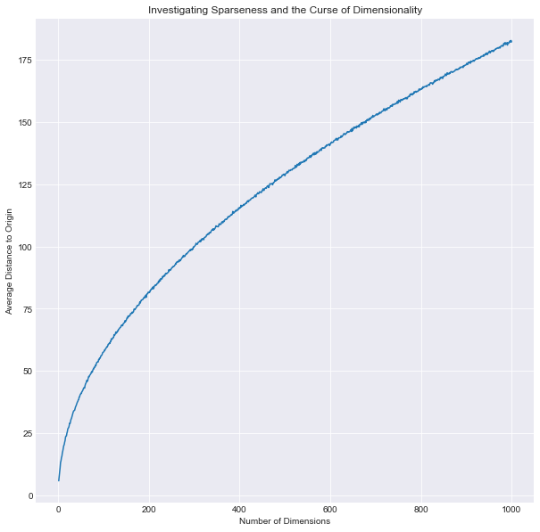
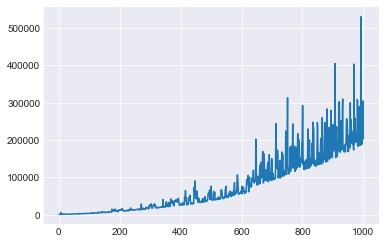
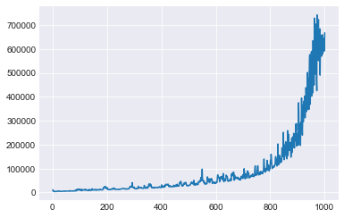
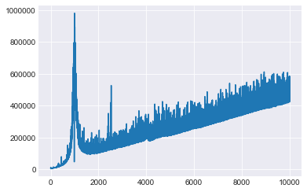

# The Curse of Dimensionality

## Introduction

The curse of dimensionality is an interesting paradox for data scientists. On the one hand, one often hopes to garner more information to improve the accuracy of a machine learning algorithm. However, there are also some interesting phenomenon that come along with larger datasets. In particular, the curse of dimensionality is based on the exploding volume of n-dimensional spaces as the number of dimensions, n, increases.

## Objectives

You will be able to:

* Explain the curse of dimensionality
* Discuss implications for the curse of dimensionality

## Sparseness in n-Dimensional Space

Points in n-dimensional space become increasingly sparse as the number of dimensions increases. That is, the distance between points will continue to grow as the number of dimensions grows. This can be problematic in a number of machine learning algorithms, in particular, when clustering points into groups. Due to the exploding nature of n-dimensional space, there is also an unwieldy number of possible combinations when searching for optimal parameters to a machine learning algorithm. 


To demonstrate this, you'll generate this graph in the upcoming lab:  


This image demonstrates how the average distance between points and the origin continues to grow as the number of dimensions increases, even though each dimension has a fixed range. Simply increasing the number of dimensions continues to make individual points more and more sparse.

## Implications

The main implication of the curse dimensionality is that optimization problems can become infeasible as the number of features increases. The practical limit will vary based on your particular computer, and the time that you have to invest in a problem. As you'll see in the upcoming lab, this relationship is exponential. For machine learning algorithms that involve backpropagation, or iterative convergence, including Lasso and Ridge regression, this will drastically impact the size of feasible solvable problems.

The sparsity of points also has additional consequences. Due to the sheer scale of potential points in an n-dimensional space as n continues to grow, the probability of seeing a particular point (or even nearby point) continues to plummet. This means that there are apt to be entire regions of an n-dimensional space that have yet to be explored. As such, if no such information from the training set is available regarding such cases, then making predictions regarding these cases will be guesswork. Put another way, with the increasing sparsity of points, you have an ever decreasing proportionate sample of the space. For example, a thousand observations in a 3 dimensional space might be quite powerful and provide sufficient information to determine a relevant classification or regression model. However, a thousand observations in a million-dimensional space is apt to be utterly useless in determining which features are most influential and to what degree. 

## Summary

The curse of dimensionality presents an intriguing paradox. On the one hand, more features allow one to account for additional influences to account for variance and nuances required to accurately model a given machine learning model. On the other hand, as the number of dimensions increases, the accompanying volume of the hyperspace explodes exponentially. As such, the potential amount of information required to accurately model such space become increasingly complex. (This is not always the case; a simple line can still exist in a 10-dimensional space, but the problems one is apt to be tackling when employing 10 features are most likely increasingly complex.) With this, more and more observations will be required to produce an adequate model.


```python
# __SOLUTION__ 
import numpy as np
```


```python
# __SOLUTION__ 
def euclidean_distance(p1, p2):
    p1, p2 = np.array(p1), np.array(p2) #Ensure p1/p2 are NumPy Arrays
    return np.sqrt(np.sum(np.square(p2-p1)))
```


```python
# __SOLUTION__ 
import matplotlib.pyplot as plt
import seaborn as sns
%matplotlib inline
sns.set_style('darkgrid')
```


```python
# __SOLUTION__ 
avg_distances = []
for n in range(1, 1001):
    avg_distances.append(np.mean([euclidean_distance(np.random.uniform(low=-10, high=10, size=n), [0 for i in range(n)]) for p in range(100)]))
plt.figure(figsize=(10,10))
plt.plot(range(1,1001), avg_distances)
plt.xlabel('Number of Dimensions')
plt.ylabel('Average Distance to Origin')
plt.title('Investigating Sparseness and the Curse of Dimensionality');
```





```python
# __SOLUTION__ 
import pandas as pd
import datetime
from sklearn.linear_model import LinearRegression, Lasso
```


```python
# __SOLUTION__ 
ols = LinearRegression()
```


```python
# __SOLUTION__ 
sample_size = 10**3
times = []
for n in range(1,1001):
    xi = [np.random.uniform(low=-10, high=10, size=n) for i in range(sample_size)]
    coeff = np.array(range(1,n+1))
    yi = np.sum(coeff*xi, axis=1) + np.random.normal(loc=0, scale=.1, size=sample_size)
    ols = LinearRegression()
    start = datetime.datetime.now()
    ols.fit(xi, yi)
    end = datetime.datetime.now()
    elapsed = end - start
    times.append(elapsed)
plt.plot(range(1,1001), [t.microseconds for t in times]);
```


    [<matplotlib.lines.Line2D at 0x1a201dec50>]





```python
# __SOLUTION__ 
sample_size = 10**3
times = []
for n in range(1,1001):
    xi = [np.random.uniform(low=-10, high=10, size=n) for i in range(sample_size)]
    coeff = np.array(range(1,n+1))
    yi = np.sum(coeff*xi, axis=1) + np.random.normal(loc=0, scale=.1, size=sample_size)
    ols = Lasso()
    start = datetime.datetime.now()
    ols.fit(xi, yi)
    end = datetime.datetime.now()
    elapsed = end - start
    times.append(elapsed)
plt.plot(range(1,1001), [t.microseconds for t in times]);
```


    [<matplotlib.lines.Line2D at 0x10e3efba8>]





```python
# __SOLUTION__ 
sample_size = 10**3
times = []
for n in range(1,10001):
    start = datetime.datetime.now()
    xi = [np.random.uniform(low=-10, high=10, size=n) for i in range(sample_size)]
    coeff = np.array(range(1,n+1))
    yi = np.sum(coeff*xi, axis=1) + np.random.normal(loc=0, scale=.1, size=sample_size)
    ols = Lasso()
    ols.fit(xi, yi)
    end = datetime.datetime.now()
    elapsed = end - start
    times.append(elapsed)
plt.plot(range(1,10001), [t.microseconds for t in times]);
```




