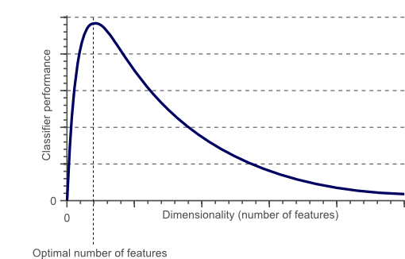
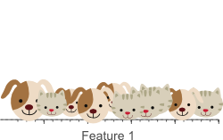
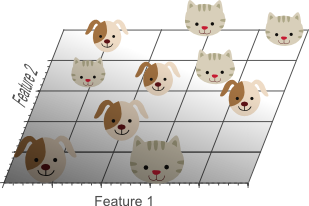
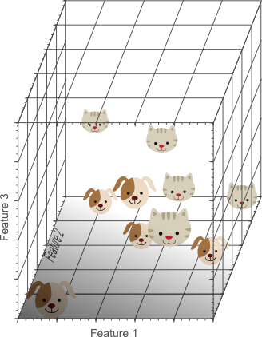
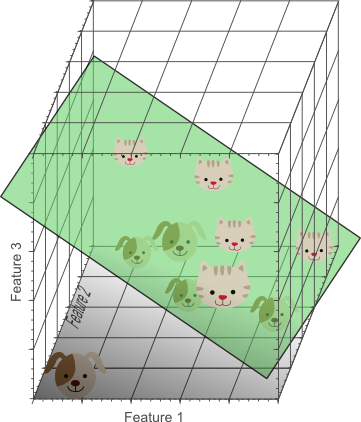
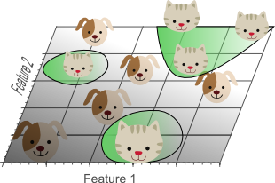
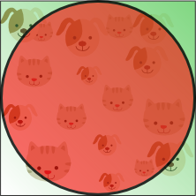
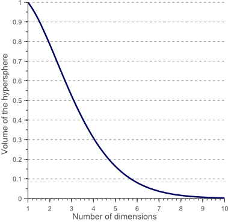
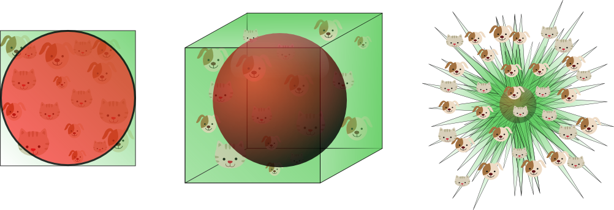

# Curse of Dimensionality 

## Introduction
Recently the terms "Curse of dimensionality" and "Dimensionality reduction"  are becoming very popular in the field of big data analytics in the areas of machine learning and NLP etc. It doesn't take long before a data scientist comes across these problems in real world scenarios. In this lesson, we shall introduce curse of dimensionality, what does it entail and why can be a serious problem as the size of our data grows.

## Objectives 
You will be able to:
- Describe the reasons behind the curse of dimensionality
- Explain curse of dimensionality using intuitive examples
- Describe what is meant by sparsity and how is it related to dimensionality

## What is Curse of Dimensionality ?

We've so far looked at analyzing different datasets in a variety of contexts. Most of the datasets we dealt with were well manageable in terms of their size (number of examples) and dimensionality (number of features). In this lesson, we will think about extremely high dimensional data. We saw how a straight line becomes a plane as we move from 2-D to 3-D regression. We can't picture measurements higher than three, yet we must be mindful towards the fact that geometry in higher measurements is not quite the same as geometry in 2D or 3D space. Various parts of higher dimensional geometry are very complex and non-intuitive and this is an important aspect of what we call "The Curse of Dimensionality".

### Example

Consider an scenario where we have a dataset of different images, each of which belongs to the classes "cat" or  "dog" as shown in the image below . The analytical task in hand is about classifying the data so our algorithm can understand cats from dogs.


First we need to convert this data into sets of numbers so that our classifier can learn from them. This is analogous to converting text data into a numerical representation with TF/IDF etc. One criteria could be using colors of these images to distinguish between them. A naive descriptor could consist of three numbers to represent the RGB (Red-Green-Blue) colors. A simple decision tree type classifier can induce following rule from dataset:
```
If 0.4 * R + 0.6 * G + 0.7 * B > 0.5 : 
    return cat 
else :
    return dog
```
As you can probably tell, image color alone will not be able to successfully discriminate between two classes. We can therefore, think about adding some new features (dimensions) in addition to color. We could decide to add some features that describe the texture of the image. For example, calculating the average edge or gradient intensity in both the X and Y direction. Adding these 2 new features (x, y coordinates) to existing color features, we now have 5 features that could possibly be used for required classification task. Similar We can also add yet more features like color/texture histograms, statistical measures like correlations etc to improve the performance of the classifier. So apparently, what we see here is more features mean better classification. But this is not always the case, After a certain point, extra dimensions will starting hurting the performance as shown in the following figure. 



We can see as dimensionality increases, the classifier's performance increases until an optimal number of features is reached. 

>__Increasing the dimensionality without increasing the number of training samples results in a decrease in classifier performance, mainly due to over-fitting.__

Next we shall develop an intuition for the key point mentioned above. 

## Dimensionality and Over-Fitting 

With above problem scenario, imagine there are infinite number of cats and dogs in the world, but the data we have is quite limited. Let's say we only have 10 images to start with. Our goal would be to train our classifier on these 10 training instances, that can potentially classify all the cats and dogs in the world. Sounds challenging, right !. Let's see how adding dimensions effect the feature space.

### Feature Space
Feature space refers to the n-dimensions where your variables live (not including a target variable, if it is present). The term is used often in ML literature because a task in ML is feature extraction, hence we view all variables as features.

Let's add one feature to feature space first , the average red color, and try to classify the data using 1-D feature as shown below: 


So this is clearly not enough as there is some shade of red present for both classes. Let's add another feature e.g. the average 'green' color in the image.



So now the data is spread out in the feature space but still, we cant fit a linear classifier as these classes are still not linearly separable (no single line through the space can discriminate between two classes). Maybe things will look better with more features. Let's throw in the average blue color as a third feature. We may see something similar to image below, where we now have a 3d space.



Is this data classifiable, in the three-dimensional feature space, we can now find a plane that perfectly separates dogs from cats (Remember, this is just an example. In real world you would need a lot more than this). So a linear combination of the three features can be used to obtain perfect classification results on our training data of 10 images.


So we see in this example scenario that __increasing the number of features until perfect classification results are obtained is the best way to train a classifier__, However, earlier we discussed that this is not the case. Confusing right ? Let's try to work through this below

## Sample Density 

Note how the density of the training samples decreases exponentially when we increase the dimensionality of the problem. It is going from being __very dense__ to __very sparse__. 

- In the 1D case with 10 training instances covered the complete 1D feature space having 5 unit intervals giving sample density 10/5=2 samples/interval.

- In the 2D case, we still have 10 training instances, which now cover a 2D feature space with an area of 5x5=25 unit squares. Therefore, in the 2D case, the sample density is 10/25 = 0.4 samples/interval. 

- In the 3D case, the 10 samples are spread over a feature space volume of 5x5x5 = 125 unit cubes. Therefore, in the 3D case, the sample density is 10/125 = 0.08 samples/interval.


- __The notion of a feature space having a very low density of examples is known as "Sparsity"__.

If we would keep adding features, our feature space becomes more sparse. Due to this sparsity, it becomes easier to find a separable hyperplane because the likelihood that a training sample lies on the wrong side of the best hyperplane becomes infinitely small when the number of features becomes infinitely large. However, if we project the highly dimensional classification result back to a lower dimensional space, a serious problem associated with this approach arises as shown below:



Above, we have results of 3 feature classification in a 3-D space, projected back to a 2-D space. The data was linearly separable in the 3D, but not in a lower dimensional feature space. Adding the third dimension performs a complicated __non-linear__ classifier in the lower dimensional feature space. As a result, the classifier learns the existence and appearance of 10 instances in great detail, along with exceptions. Because of this, the resulting classifier will most likely fail on real-world data, consisting of an infinite amount of unseen cats and dogs that often do not adhere to these appearances and exceptions.

Such over-fitting is a direct result of the curse of dimensionality. The following figure shows the result of a linear classifier that has been trained using only 2 features instead of 3.


Although this is not perfect classification as we had in 3D, this classifier will be more __generalizable__ for previously unseen data. In other words, by using less features, the curse of dimensionality can be avoided such that our classifier does not over-fit training data. 


## Continuous Features

Let's say we want to train a classifier using only a single unique feature with value ranges from 0 to 1. 

- If we want our training data to cover 20% of this range, then the amount of training data needed is 20% of the complete population of cats and dogs. 
- If we add another feature, resulting in a 2D feature space, to cover 20% of the 2D feature range, we now need to obtain 45% of the complete population of cats and dogs in each dimension (0.45^2 = 0.2). 
- In the 3D case this gets even worse: to cover 20% of the 3D feature range, we need to obtain 58% of the population in each dimension (0.58^3 = 0.2).


#### So what do we conclude from above ?

- If the amount of available training data is fixed, then overfitting occurs if we keep adding dimensions.

- If we keep adding dimensions, the amount of training data needs to grow exponentially fast to maintain the same coverage and to avoid overfitting.

This can be summarized as :
__Dimensionality Causes Sparsity__

## Non-uniform Sparseness
Another effect of the curse of dimensionality, is that this sparseness is not uniformly distributed over the feature space. In fact, data around the origin (at the center of the hypercube) is much more sparse than data in the corners of the space. 

Imagine a unit square that represents the 2D feature space. The average of the feature space is the center of this unit square, and all points within unit distance from this center, are inside a unit circle that inscribes the unit square as shown below:



The training samples that do not fall within this unit circle are closer to the corners of the search space than to its center. These samples are difficult to classify because their feature values greatly differs (e.g. samples in opposite corners of the unit square). Therefore, classification is easier if most samples fall inside the inscribed unit circle.

An interesting question is now how the volume of the circle (a hypersphere) changes relative to the volume of the square (a hypercube) when we increase the dimensionality of the feature space.
The following plot shows how the volume of the inscribing hypersphere of dimension d and with radius 0.5 changes when the dimensionality increases:


In high dimensional spaces, __most of the training data resides in the corners of the hypercube__ defining the feature space.Instances in the corners of the feature space are much more difficult to classify than instances around the centre of the hypersphere. Following  shows a 2D unit square, a 3D unit cube, and an imaginative visualization of an 8D hypercube which has 2^8 = 256 corners.


### Distance Measures and Dimensionality 

Most distance measures ((e.g. Euclidean, Mahalanobis, Manhattan etc.) are less effective in highly dimensional spaces.Classification is often easier in lower-dimensional spaces where less features are used to describe the object of interest. Similarly, Gaussian likelihoods become flat and heavy tailed distributions in high dimensional spaces.

- __In high dimensional space, the ratio of the difference between the minimum and maximum likelihood and the minimum likelihood itself tends to zero__.


Next, we shall look at the techniques available to deal with the curse of dimensionality. We shall look at some machine learning and feature extraction techniques to bring a high dimensional data into a low dimensional space. 

## Additional Resources

You are encouraged to refer to following documents for further details/examples on curse of dimensionality 

- [Surprises in High Dimensions, Hypershpare and Hypercube](http://www.maths.manchester.ac.uk/~mlotz/teaching/suprises.pdf)
- [Machine Learning: Curse of Dimensionality](https://www.edupristine.com/blog/curse-dimensionality)
- [Curse on Dimensionality (in a regression context)](https://shapeofdata.wordpress.com/2013/04/02/the-curse-of-dimensionality/)


## Summary

In this lesson, we looked at an introduction to curse of dimensionality and saw how increasing dimensions. without increasing the number of training examples can lead to poor classification (as well as prediction). NExt, we shall look at how to avoid such a scenario and what options to we have available to us.
